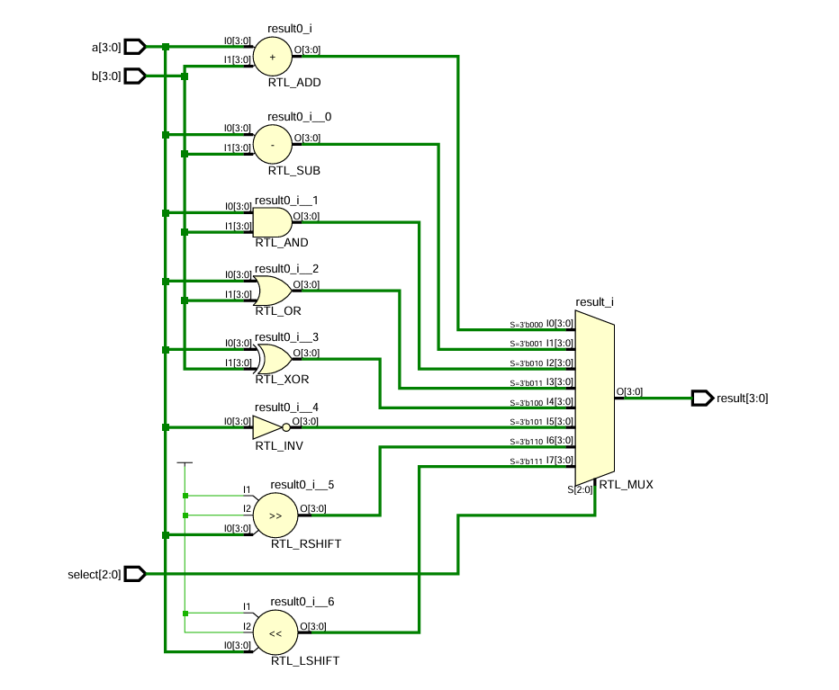
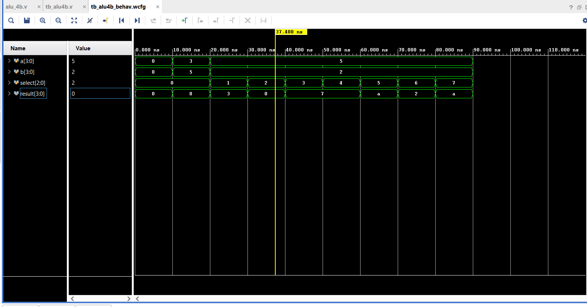

# Verilog-4Bit-ALU
 A synthesizable 4-bit Arithmetic Logic Unit (ALU) designed in Verilog. Implements 8 parallel operations (Arithmetic, Logic, Shift) with a verified testbench and overflow analysis using Xilinx Vivado.
# Verilog-4Bit-ALU

## Overview
A synthesizable **4-bit Arithmetic Logic Unit (ALU)** designed in Verilog HDL. This project implements a **Combinational Logic** circuit that performs 8 distinct operations (Arithmetic, Logic, and Shift).

The design features a **Parallel Execution Architecture**, where all logic units compute results simultaneously, and a Multiplexer selects the final output based on a 3-bit control signal. The project was verified using **Xilinx Vivado**.

## Features
* **Architecture:** Parallel Logic Execution with Multiplexed Output.
* **Operations:** Addition, Subtraction, Bitwise AND/OR/XOR/NOT, and Logical Shifts.
* **Verification:** Self-checking testbench covering corner cases.
* **Synthesis:** Efficient RTL design using `case` statements for MUX inference.

## Functional Truth Table
The ALU accepts two 4-bit inputs (`a`, `b`) and a 3-bit selector (`select`).

| Select Code | Operation | Verilog Operator | Description |
| :---  | :---            | :---             | :---     |
| `000` | **Addition**    | `a + b`          | Adds inputs. |
| `001` | **Subtraction** | `a - b`          | Subtracts B from A. |
| `010` | **AND**         | `a & b`          | Bitwise AND. |
| `011` | **OR**          | `a \| b`         | Bitwise OR. |
| `100` | **XOR**         | `a ^ b`          | Bitwise Exclusive OR. |
| `101` | **NOT**         | `~a`             | Bitwise Inversion of A. |
| `110` | **Shift Right** | `a >> 1`         | Logical Right Shift (Divide by 2). |
| `111` | **Shift Left**  | `a << 1`         | Logical Left Shift (Multiply by 2). |

## Hardware Architecture (RTL)
The synthesis results confirm a parallel architecture. As seen in the schematic below, the inputs feed into all operation blocks (`RTL_ADD`, `RTL_SUB`, `RTL_AND`, etc.) simultaneously. The `RTL_MUX` at the end ensures stable output selection.



## Simulation & Analysis
The design was verified using behavioral simulation in Vivado.

**Key Observation: Unsigned vs Signed Output**
In the waveform below, the addition of `3 + 5` results in `8` (Binary `1000`).
* **Unsigned View:** `1000` is correctly displayed as **8**.
* **Signed Context:** If interpreted as a 4-bit signed number, `1000` represents **-8** (Overflow), as the magnitude exceeds the 4-bit signed limit (+7).



## Project Structure
```text
Verilog-4Bit-ALU/
├── src/
│   └── alu_4b.v         # Main RTL Design
├── tb/
│   └── tb_alu4b.v       # Testbench (Verification)
├── docs/
│   ├── rtl_schematic.png
│   └── simulation_waveform.png
└── README.md

## Tools Used

* **​Language:** Verilog HDL
* **​IDE**: Xilinx Vivado 2025.2
​* **Simulation**: Vivado Simulator


