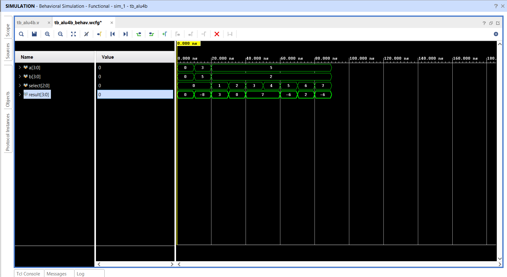

# Verilog-4Bit-ALU
 A synthesizable 4-bit Arithmetic Logic Unit (ALU) designed in Verilog. Implements 8 parallel operations (Arithmetic, Logic, Shift) with a verified testbench and overflow analysis using Xilinx Vivado.

## Overview
A synthesizable **4-bit Arithmetic Logic Unit (ALU)** designed in Verilog HDL. This project implements a **Combinational Logic** circuit that performs 8 distinct operations (Arithmetic, Logic, and Shift).

The design features a **Parallel Execution Architecture**, where all logic units compute results simultaneously, and a Multiplexer selects the final output based on a 3-bit control signal. The project was verified using **Xilinx Vivado**.

## Features
* **Architecture:** Parallel Logic Execution with Multiplexed Output.
* **Operations:** Addition, Subtraction, Bitwise AND/OR/XOR/NOT, and Logical Shifts.
* **Verification:** Self-checking testbench covering corner cases.
* **Synthesis:** Efficient RTL design using `case` statements for MUX inference.

## Functional Truth Table
The ALU accepts two 4-bit inputs (`a`, `b`) and a 3-bit selector (`select`).

| Select Code | Operation | Verilog Operator | Description |
| :---  | :---            | :---             | :---     |
| `000` | **Addition**    | `a + b`          | Adds inputs. |
| `001` | **Subtraction** | `a - b`          | Subtracts B from A. |
| `010` | **AND**         | `a & b`          | Bitwise AND. |
| `011` | **OR**          | `a \| b`         | Bitwise OR. |
| `100` | **XOR**         | `a ^ b`          | Bitwise Exclusive OR. |
| `101` | **NOT**         | `~a`             | Bitwise Inversion of A. |
| `110` | **Shift Right** | `a >> 1`         | Logical Right Shift (Divide by 2). |
| `111` | **Shift Left**  | `a << 1`         | Logical Left Shift (Multiply by 2). |

## Hardware Architecture (RTL)
The synthesis results confirm a parallel architecture. As seen in the schematic below, the inputs feed into all operation blocks (`RTL_ADD`, `RTL_SUB`, `RTL_AND`, etc.) simultaneously. The `RTL_MUX` at the end ensures stable output selection.


## Simulation & Analysis
The design was verified using behavioral simulation in Vivado.

**Key Observation: Unsigned vs Signed Output**
In the waveform below, the addition of `3 + 5` results in `8` (Binary `1000`).
* **Unsigned View:** `1000` is correctly displayed as **8**.
* **Signed Context:** If interpreted as a 4-bit signed number, `1000` represents **-8** (Overflow), as the magnitude exceeds the 4-bit signed limit (+7).


## ⚠️ Signed Overflow Case Study: The "-8" Result

A key learning outcome of this project was the analysis of **2's complement overflow** during simulation.

### **Observations**
* **The Operation:** At the **10ns mark**, input `a = 3` and `b = 5` were added.
* **The Result:** While the unsigned result is **8**, the 4-bit signed representation is **-8**.

### **Technical Reason**
In a 4-bit signed system, the range is strictly restricted to **-8 to +7**. The binary value `1000` (which represents 8 in unsigned) has a **1 in the Most Significant Bit (MSB)**. In 2's complement representation, this leading '1' causes the system to interpret the value as a **negative number**.

### **Impact**
This demonstrates **Arithmetic Overflow**, where a positive addition exceeds the system's storage capacity and "wraps around" into the negative range. This highlight underscores the importance of **overflow detection logic** in ALU design to ensure mathematical accuracy.



## 🚀 Room for Improvement

While the current 4-bit ALU successfully performs its primary operations, the analysis of the **-8 signed result** reveals clear opportunities for future hardware enhancements:

### **1. Bit-Width Expansion (5-Bit Result)**
* **The Goal:** To prevent arithmetic overflow when adding values like $3+5$ or $7+1$.
* **The Logic:** By expanding the `result` bus from **4 bits to 5 bits**, the ALU can store the carry bit directly within the result. This allows it to represent values up to 31 (unsigned) or +15/-16 (signed), ensuring that $3+5$ correctly displays as **+8** instead of wrapping around to **-8**.

### **2. Implementation of Error Flags (Overflow Flag)**
* **Status Flags:** A professional ALU uses a **Status Register** to indicate errors.
* **The Overflow Flag (V):** I plan to add logic that compares the sign bits of the inputs ($a[3]$ and $b[3]$) against the sign bit of the output ($result[3]$). If two positive numbers result in a negative number (as seen in the `signed_simulation_waveform.png`), the **V-Flag** will trigger High, alerting the system that an arithmetic error has occurred.


### **3. Enhanced Arithmetic & Scalability**
* **Arithmetic Right Shift (>>>):** Upgrading the shift logic to preserve the sign bit during division.
* **Parameterization:** Refactoring the code using `parameter WIDTH = 4` to allow the ALU to be scaled to 8, 16, or 32-bit architectures with a single line change.

## 🛠️ Tools Used

* **Language:** Verilog HDL 
* **Software/IDE:** Xilinx Vivado 
* **Simulation:** Vivado Simulator (XSim) 


## Project Structure
```text
Verilog-4Bit-ALU/
├── src/
│   └── alu_4b.v         # Main RTL Design
├── tb/
│   └── tb_alu4b.v       # Testbench (Verification)
├── docs/
│   ├── rtl_schematic.png
│   └── simulation_waveform.png
└── README.md


